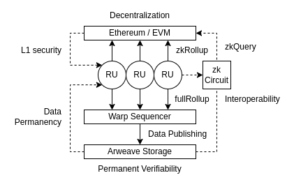

# zkJSON Litepaper v0.1

```
     _        _  _____  ____  _   _   _      _ _                                   
     | |      | |/ ____|/ __ \| \ | | | |    (_) |                                  
  ___| | __   | | (___ | |  | |  \| | | |     _| |_ ___ _ __   __ _ _ __   ___ _ __ 
 |_  / |/ /   | |\___ \| |  | | . ` | | |    | | __/ _ \ '_ \ / _` | '_ \ / _ \ '__|
  / /|   < |__| |____) | |__| | |\  | | |____| | ||  __/ |_) | (_| | |_) |  __/ |   
 /___|_|\_\____/|_____/ \____/|_| \_| |______|_|\__\___| .__/ \__,_| .__/ \___|_|   
                                                       | |         | |              
                                                       |_|         |_|              
```

## Zero Knowledge Provable JSON

**zkJSON** makes any arbitrary JSON data provable with zero knowledge proof, and makes them verifiable both offchain and onchain (blockchain).

EVM blockchains like Ethereum will get a hyper scalable NoSQL database extension whereby off-chain JSON data are directly queriable from within Solidity smart contracts.

<div align="center"></div>

### Why

Most offchain data on the web are represented in JSON format, and blockchains have been failing to connect with them efficiently for some critical reasons.

- Blockchains are not scalable to the web level
- There is no decentralized general-purpose database alternative to cloud databases
- The current decentralized database solutions are too domain-specific
- The current oracle / indexer solutions are limited to a great extent

As a result, data on web2 (offchain) and web3 (onhain) are divided and web3 is missing a great wide variety of use cases with offchain data. What if we could verify any offchain JSON data in onchain smart contracts, and also build a general-purpose database with web2-like performance and scalability? zkJSON and zkDB will allow direct connections from smartcontract to offchain database. And we will further make it practical and sustainable with modular blockchain rollups ([Ethereum](https://ethereum.org/) security + [Arweave](https://arweave.org/) permanency and scalability) and a decentralized physical infrastructure network ([DePIN](https://medium.com/@perma_dao/unveiling-the-background-of-weavedb-and-kwildb-as-mentioned-by-messari-f1d631ec2c91)) using [Cosmos IBC](https://cosmos.network/ibc/).

This entire tech stack will enable novel use cases to web3 such as decentralized oracles and indexers, as well as provide a decentralized database alternative to web2 with the performance and scalability of cloud databases. We could, for instance, build [a fully decentralized Twitter](https://www.jots.social/) without any centralized components. Connecting securely with offchain data with privacy is also the way to bring in enterprise use cases to web3 in combination with DID and Verifiable Credentials (VC). We are working on it too with [PolygonID](https://polygonid.com/) and [ICP VETKeys](https://internetcomputer.org/blog/features/vetkey-primer).

We envision the web where offchain data are seamlessly connected with blockchains. Our ultimate goal is to liberate the web2 data silos and redirect the huge monopolistic web2 revenue models such as ad networks and future AI-based networks to web3. Any offchain data without zkJSON are not legit, since they are not verifiable onchain.

Onchain verifiability is what scales the decentralized web. Onchain is the new online, and zkJSON expands what's online/onchain (verifiable).

### How

There are 4 steps to build a complete solution.

1. make any JSON provable with zk circuits - **zkJSON**
2. build a database structure with merkle trees and zkJSON - **zkDB**
3. commit db states to an EVM blockchain - **zkRollup**
4. make it queriable with Solidity - **zkQuery**

And 3 bonus steps to make it practical and sustainable (using Arweave & Cosmos IBC).

5. make zkDB feature-rich to bear any web2/web3 usages - **WeaveDB**
6. make WeaveDB performant, scalable, and secure with Arweave+EVM hybrid rollup - **WeaveDB Rollup**
7. make the rollups sustainable with DePIN - **WeaveChain**

*This repo contains only the first 4 steps.* You can find the rest [here](https://github.com/weavedb/weavedb).

#### zkJSON

The key to making JSON verifiable with zkp is to invent a deterministic encoding that is friendly to zk circuits. zk circuits can only handle arithmetic operations with natural numbers, so we need to convert any JSON to a series of natural numbers back and forth, then pack everything into as few `uint` as possible to efficiently save space. The default storage block in Solidity is `uint256` and Circom uses a modulo just below the 256 bit range. So optimizing for `uint` makes sense. Just to clarify, you cannot simply convert JSON to a binary format or any existing encoding formats, because it has to specifically make sense to the circuit logic and Solidity.

##### Encoding

<div align="center"></div>

zk circuits can neither handle objects nor dynamically nested arrays. So we first need to flatten all the paths into a simple array.

```js
{
  "a": 1,
  "c": false,
  "b": { "e": null, "d": "four" },
  "f": 3.14,
  "ghi": [ 5, 6, 7 ],
}
```

becomes

```js
[
  [ "a", 1 ],
  [ "c", false ]
  [ "b.e", null ],
  [ "b.d", "four" ],
  [ "f", 3.14 ],
  [ "ghi", [ 5, 6, 7 ] ],
]
```
Each path will be converted to an unicode number.

```js
[
  [ [ [ 97 ] ], 1 ],
  [ [ [ 99 ] ], false ]
  [ [ [ 98 ], [ 101 ] ], null ],
  [ [ [ 98 ], [ 100 ] ], "four" ],
  [ [ [ 102 ] ], 3.14 ],
  [ [ [ 103, 104, 105 ] ], [ 5, 6, 7 ] ]
]
```

To make it deterministic, items must be lexicographically sorted by the paths.

```js
[
  [ [ [ 97 ] ], 1 ],
  [ [ [ 98 ], [ 100 ] ], "four" ],
  [ [ [ 98 ], [ 101 ] ], null ],
  [ [ [ 99 ] ], false ]
  [ [ [ 102 ] ], 3.14 ],
  [ [ [ 103, 104, 105 ] ], [ 5, 6, 7 ] ]
]
```

Here's a tricky part, if the value is an array, we need to create a path for each element, but we need to tell the difference between `ghi.0` and `ghi[0]` with just numbers. `ghi.0` is a path to an object, `ghi[0]` is a path to an array element. Also there is a case where the key is empty like `{ "" : "empty" }`. Another case to note is that just a primitive value without the top level element being an object is also a valid JSON, such as `null`, `true`, `[ 1, 2, 3]`, `1`. You can express the paths with empty string ` `, or something like `a..b` for `{ "a" : { "" : { "b" : 1 } } }`.

To address all these edge cases, we prefix each array key with the number of characters that follow, or `0` if the key is empty (followed by `1`) or an array index (followed by another`0`).

```js
[
  [ [ [ 1, 97 ] ], 1 ],
  [ [ [ 1, 98 ], [ 1, 100 ] ], "four" ],
  [ [ [ 1, 98 ], [ 1, 101 ] ], null ],
  [ [ [ 1, 99 ] ], false ]
  [ [ [ 1, 102 ] ], 3.14 ],
  [ [ [ 3, 103, 104, 105 ], [ 0, 0, 0 ] ], 5 ],
  [ [ [ 3, 103, 104, 105 ] ], [ 0, 0, 1 ], 6 ],
  [ [ [ 3, 103, 104, 105 ] ], [ 0, 0, 2 ], 7 ]
]
```

Now we flatten the paths but also prefix them with how many nested keys each path contains.

```js
[
  [ 1, 1, 97 ], 1 ],
  [ 2, 1, 98 , 1, 100 ], "four" ],
  [ 2,  1, 98, 1, 101 ], null ],
  [ 1, 1, 99 ], false ]
  [ 1, 1, 102 ], 3.14 ],
  [ 2, 3, 103, 104, 105, 0, 0, 0 ], 5 ],
  [ 2, 3, 103, 104, 105, 0, 0, 1 ], 6 ],
  [ 2, 3, 103, 104, 105, 0, 0, 2 ], 7 ]
]
```
If the top level is a non-object value such as `1` and `null`, the flattened path is always `[ 1, 0, 1 ]`.

Let's numerify the values in a similar fashion. There are only 6 valid data types in JSON ( `null` / `boolean` / `number` / `string` / `array` / `object` ), and since the paths are flattened, we need to handle only 4 primitive types. We assign a type number to each.

- null (`0`)
- boolean (`1`)
- number (`2`)
- string (`3`)
- array | object (`4`)

The first digit will always be the type number.

###### null (0)

`null` is always `[ 0 ]` as there's nothing else to tell.

###### boolean (1)

There are only 2 cases. `true` is `[ 1, 1 ]` and `false` is `[ 1, 0 ]`.

###### number (2)

`number` is a bit tricky as we need to differentiate integers and floats, and also positive numbers and negative ones. Remember that circuits can only handle natural numbers. A number contains 4 elements.

- 1st element - type `2`
- 2nd - sign, `0` for negative, `1` for positive
- 3rd - how many digits after `.`, `0` in case of an integer
- 4th - actual number without `.`

for instance,

- `1` : `[ 2, 1, 0, 1 ]`
- `-1` : `[ 2, 0, 0, 1 ]`
- `3.14` : `[ 2, 1, 2, 314 ]`

###### string (3)

The first digit is the type `3` and the second digit tells how many characters, then each character is converted to a unicode number (e.g. `abc` = `[ 3, 3, 97, 98, 99 ]`).

###### array | object (4)

In the case of an array and object, it prefixes `4` and recursively encodes all the nested values. The final array includes internal paths too.

- `[ 1, 2 ]` : `[ 4, 1, 0, 0, 0, 2, 1, 0, 1, 1, 0, 0, 1, 2, 1, 0, 2 ]`

Note that the path to `1` is `1, 0, 0, 0` and the path to `2` is `1, 0, 0, 1`, and they are included.

Now let's convert the values in our original JSON example.

```js
[
  [ [ 1, 1, 97 ], [ 2, 1, 0, 1 ] ],
  [ [ 2, 1, 98 , 1, 100 ], [ 3, 4, 102, 111, 117, 114 ] ],
  [ [ 2,  1, 98, 1, 101 ], [ 0 ] ],
  [ [ 1, 1, 99 ], [ 1, 0 ] ],
  [ [ 1, 1, 102 ], [ 2, 1, 2, 314 ] ],
  [ [ 2, 3, 103, 104, 105, 0, 0, 0 ], [ 2, 1, 0, 5 ] ],
  [ [ 2, 3, 103, 104, 105, 0, 0, 1 ], [ 2, 1, 0, 6 ] ],
  [ [ 2, 3, 103, 104, 105, 0, 0, 2 ], [ 2, 1, 0, 7 ] ]
]
```
Now we are to flatten the entire nested arrays, but each number must be prefixed by the number of digits that contains, otherwise, there's no way to tell where to partition the series of digits. And here's another tricky part, if the number contains more than 9 digits, you cannot prefix it with 10, 11, 12 ... because when all the numbers are concatenated later, `10` doesn't mean that `10` digits follow, but it means `1` digit follows and it's `0`. So we allow max 8 digits in each partition and `9` means there will be another partition(s) following the current one.

- `123` : `[ 3, 123 ]`
- `12345678` : `[ 8, 12345678 ]`
- `1234567890` : `[ 9, 12345678, 2, 90 ]`

By the way, digits are in fact stored as strings, so a leading 0 won't disappear.

- `1234567809` : `[ "9", "12345678", "2", "09" ]`

This is the prefixed version.

```js
[
  [ [ 1, 1, 1, 1, 2, 97 ], [ 1, 2, 1, 1, 1, 0, 1, 1 ] ],
  [ [ 1, 2, 1, 1, 2, 98 , 1, 1, 3, 100 ], [ 1, 3, 1, 4, 3, 102, 3, 111, 3, 117, 3, 114 ] ],
  [ [ 1, 2,  1, 1, 3, 98, 1, 1, 3, 101 ], [ 1, 0 ] ],
  [ [ 1, 1, 1, 1, 2, 99 ], [ 1, 1, 1, 0 ] ],
  [ [ 1, 1, 1, 1, 3, 102 ], [ 1, 2, 1, 1, 1, 2, 3, 314 ] ],
  [ [ 1, 2, 1, 3, 3, 103, 3, 104, 3, 105, 1, 0, 1, 0, 1, 0 ], [ 1, 2, 1, 1, 1, 0, 1, 5 ] ],
  [ [ 1, 2, 1, 3, 3, 103, 3, 104, 3, 105, 1, 0, 1, 0, 1, 1 ], [ 1, 2, 1, 1, 1, 0, 1, 6 ] ],
  [ [ 1, 2, 1, 3, 3, 103, 3, 104, 3, 105, 1, 0, 1, 0, 1, 2 ], [ 1, 2, 1, 1, 1, 0, 1, 7 ] ]
]
```

Then this is the final form all flattened.

```js
[ 1, 1, 1, 1, 2, 97, 1, 2, 1, 1, 1, 0, 1, 1, 1, 2, 1, 1, 2, 98, 1, 1, 3, 100, 1, 3, 1, 4, 3, 102, 3, 111, 3, 117, 3, 114, 1, 2, 1, 1, 3, 98, 1, 1, 3, 101, 1, 0, 1, 1, 1, 1, 2, 99, 1, 1, 1, 0, 1, 1, 1, 1, 3, 102, 1, 2, 1, 1, 1, 2, 3, 314, 1, 2, 1, 3, 3, 103, 3, 104, 3, 105, 1, 0, 1, 0, 1, 0, 1, 2, 1, 1, 1, 0, 1, 5, 1, 2, 1, 3, 3, 103, 3, 104, 3, 105, 1, 0, 1, 0, 1, 1, 1, 2, 1, 1, 1, 0, 1, 6, 1, 2, 1, 3, 3, 103, 3, 104, 3, 105, 1, 0, 1, 0, 1, 2, 1, 2, 1, 1, 1, 0, 1, 7 ]
```
It's 144 integers, or 182 digits. The original JSON was 66 character long when JSON.stringified, so it's not too bad considering integer vs character (let's say one ascii char takes up 3 digits and one unicode char takes up 7 digits). And zk circuits and Solidity cannot handle just stringified JSONs anyway. But it gets better.

When passed to a circuit, all digits will be concatenated into one integer. [Circom](https://docs.circom.io/circom-language/basic-operators/) by default uses a modulo with

`21888242871839275222246405745257275088548364400416034343698204186575808495617` (77  digits)

which means up to 76 digits are safe and a 77-digit number could overflow, which is also within the range of `uint / uint256` in Solidity.

So to convert the encoded array to a circuit signal, it becomes

```js
[
  1111297121110111211298113100131431023111311731141211298113101101111299111011,
  1131021211123314121331033104310510101012111015121331033104310510101112111016,
  121331033104310510101212111017
]
```

What's surprising here is that the entire JSON is compressed into just 3 integers in the end. It's just `uint[3]` in Solidity. This indeed is extreme efficiency! The zkJSON circuit by default allows up to 256 integers (256 * 76 digits), which can contain a huge JSON data size, and Solidity handles it efficiently with a dynamic array `uint[]`. What's even better is that the only bits passed to Solidity is the tiny bits of the value at the queried path, and not the entire JSON bits. So if you are querying the value at the path `a`, `1111297`(path: "a") and `12111011`(value: 1) are the only digits passed to Solidity as public signals of zkp.

Now we can build a circuit to handle these digits and prove the value of a selected path without revealing the entire JSON. It's easy to explain the encoding, but harder to write the actual encoder/decoder and a circuit to properly process this encoding. But fortunately, we already did write them!

- [zkJSON Circuit](https://github.com/weavedb/zkjson/blob/master/circom/json/json.circom)
- [A simple zkJSON demo](https://zkjson-zeta.vercel.app/)
- [Arweave | Ethereum demo](https://zkjson-arweave.vercel.app)

You can use `zkjson` node package to encode and decode JSON.

```bash
yarn add zkjson
```

```javascript
const { encode, decode, toSignal, fromSignal } = require("zkjson")

const json = { a : 1 }
const encoded = encode(json) // [ 1, 1, 97, 2, 1, 0,  1 ]
const signal = toSignal(encoded) // [ '111129712111011' ]
const encoded2 = fromSignal(signal) // [ 1, 1, 97, 2, 1, 0, 1 ]
const decoded = decode(encoded2) // { a : 1 }
```

```javascript
const { encodePath, decodePath, encodeVal, decodeVal } = require("zkjson")

const path = "a"
const encodedPath = encodePath(path) // [ 1, 1, 97 ]
const decodedPath = decodePath(encodedPath) // "a"

const val = 1
const encodedVal = encodeVal(val) // [ 2, 1, 0, 1 ]
const decodedVal = decodeVal(encodedVal) // 1

```

#### zkDB

Once we get zkJSON, we can build a database structure with zkJSON as base building blocks.

A document-based NoSQL database would have collections, and each collection in turn would have a bunch of documents, which are JSONs.

<div align="center"></div>

##### Collection

We can use a sparse merkle tree ([SMT](https://docs.iden3.io/getting-started/mt/)) to represent all the document data in a collection with a root hash. SMT is perfect because curcuits cannot handle dynamic tree sizes and SMT can represent a large number of documents efficiently, and any data membership or non-nmembership can be proven efficiently with a zk proof without the actual merkle proof. This is what enables efficient direct queries to offchain databases from within EVM smart contracts.

<div align="center"></div>

Each leaf node will be the [poseidon hash](https://www.poseidon-hash.info/) of zkJSON encoding of the data. To hash 256 * 76 digits, 16 poseidon hashes are hased together into another poseidon hash. This allows a fairly large JSON size to be proven.

And each leaf node has an index number, so we need to somehow convert the document IDs to numbers without collisions. How many leaf nodes a SMT has depends on the pre-defined depth of the tree. For example, a 32-level SMT can have `2 ** 32 = 4294967296` leaf nodes. The level must be pre-defined at the circuit compile time, so we need to find the right conversion and balance.

Due to this constraint, we only allow 64 characters to keep things compact and efficient, although there can be different optimized setups for your specific use cases. 

- `A-Z` (0 - 25)
- `a-z` (26 - 51)
- `0-9` (52 - 61)
- `-` (62)
- `_` (63)

Now 2 digits can represent one character with collision free, which means we can have only up to 4 characters in document IDs with a 32-level SMT. The last allowed digit will always have the possibility of overflowing, so we prefix the converted numbers with `1` to differentiate `A` from `AA` (they are both `0` without the prefix `1`).

- `A` = `100`
- `AA` = `10000`
- `ABC` = `1000102`
- `abcd` = `126272829` 

We can of course increase the level to have more characters, but the more levels, the more computation with the circuit, so we need to find the right balance. For instance, to allow 10 characters we need 67 levels of SMT.

- `zk_WeaveDB` = `151366322302647300301` 

You can use `zkjson` to convert the string to an SMT index.

```javascript
 const { toIndex, fromIndexs } = require("zkjson")
 
 const index = toIndex("zkJSON") // 1513609181413
 const str = fromIndex(index) // "zkJSON"
```

Practically a 100-level SMT allows `15` character IDs and `1,267,650,600,228,229,401,496,703,205,376` documents in a collection. It should be sufficient for most applications if the IDs are designed wisely.

One way to have a longer ID length with the same depth is to restrict the allowed characters to less than 31 since `31 * 31 = 961`. In this case 3 digits can represent 2 characters instead of 4 digits representing 2 characters. But we won't cover it here.

- [Collection Circuit](https://github.com/weavedb/zkjson/blob/master/circom/collection/collection.circom)

##### Database

For the database, we can take the exact same approach with the collections. We can use an SMT to represent multiple collection states in a DB with one root hash, and each leaf node will be the merkle root of a collection, which in turn represents the entire documents in the collection. We could give each collection an ID with the same ID-to-index conversion as the documents, however, collection IDs are not as essential as document IDs since document IDs are usually a part of access control rules, but collection IDs are not. We can use an incremental count for collection IDs and no well-strucrtured DB has so many collections as documents. Let's say `2 ** 8 = 256`, so an 8 level SMT can give us 256 collections and it should be more than enough for most applications. If you need alphanumeric IDs for collections, you could map them with numeric indexes offchain (e.g. `0 = FirstCollection`, `1 = AnotherCollection`, `2 = YetAnotherCollection`...). Note that this is different from the deterministic `toIndex / fromIndex` conversion. In this way we can use a smaller tree and keep the circuit small.

<div align="center"></div>

Now we can write a circuit to prove a collection root hash, then we can write another circuit to prove a database root hash, which represents multiple collections within the database. This circuit can also prove any value in any JSON document in any collection in a database without revealing the entire JSON data. zkJSON enables this.

- [DB Circuit](https://github.com/weavedb/zkjson/blob/master/circom/db/db.circom)

#### zkRollup

How do we make zkDB secure and queriable from other blockchains? We can write a circuit to prove the merkle tree hash transitions and deploy a Solidity contract to verify those proofs onchain. Fortunately, Circom auto-generates a Solidity verifier for us, so we can use that function in our verifier contract. We need to keep track of the current database root merkle hash as a Solidity contract state.

```solidity
interface IZKDB {
  address public comitter;
  uint public root;
  function commit (uint[19] calldata zkp) external returns (uint);
}
```

<div align="center"></div>

- [Single Query Circuit](https://github.com/weavedb/zkjson/blob/master/circom/query/query.circom)
- [Batch Rollup Circuit](https://github.com/weavedb/zkjson/blob/master/circom/rollup/rollup.circom)

#### zkQuery

Finally, we can deploy the previous zkDB query circout verifier as a Solidity contract too, and make it possible to securely query any paths with the right proof. When querying, the Solidity contract must check the DB root hash to verify the queried value against the current database state.

```solidity
interface IZKDB {
  function qNull (uint[] memory path, uint[] calldata zkp) external view returns (bool);
  function qBool (uint[] memory path, uint[] calldata zkp) external view returns (bool);
  function qInt (uint[] memory path, uint[] calldata zkp) external view returns (int);
  function qFloat (uint[] memory path, uint[] calldata zkp) external view returns (uint[3] memory);
  function qString (uint[] memory path, uint[] calldata zkp) external view returns (string memory);
  function qRaw (uint[] memory path, uint[] calldata zkp) external view returns (uint[] memory);
}
```

`path[0]` is a collection index, and `path[1]` is a doc index, then the rest of the path follows.

`qNill` returns `true` only if the value is `null` and otherwise throws an error. And `qFloat` returns the array of encoded numbers without the type prefix ( e.g. `[ 1, 2, 314 ]` ) since Solidity cannot handle float numbers.

`qRaw` returns the raw encoded value for non-primitive data types (array and object), and you can further query the raw value with the `getX` functions. Pass the raw value returned from `qRaw` with the path to query, instead of `zkp` proof.

```solidity
interface IZKDB {
  function getNull (uint[] memory path, uint[] memory raw) external view returns (bool);
  function getBool (uint[] memory path, uint[] memory raw) external view returns (bool);
  function getInt (uint[] memory path, uint[]  memory raw) external view returns (int);
  function getFloat (uint[] memory path, uint[] memory raw) external view returns (uint[3] memory);
  function getString (uint[] memory path, uint[] memory raw) external view returns (string memory);
}
```

We will write circuits for more complex queries using some conditions such as `$where` / `$gt` / `$gte` / `$lt` / `$lte` / `$in` / `$nin` and so on.

You could also write a function to get an array of numbers or a specific data structure, but it's up to your applications what data types to extract, so we will leave it up to you.

<div align="center"></div>

- [ZKDB Solidity Contract](https://github.com/weavedb/zkjson/blob/master/solidity/contracts/ZKDB.sol)

### Going Further

With the first 4 components `zkJSON` / `zkDB` / `zkRollup` / `zkQuery`, it's now technically possible to build a fully verifiable zkp-based DB connecting blockchains and offchain data. But this doesn't mean it's practical in real use cases. We will briefly introduce 3 additional steps of `WeaveDB` / `WeaveDB Rollup` / `WeaveChain` to implement zkDB in our real world.

#### WeaveDB

WeaveDB is a general-purpose NoSQL database as a smart contract. It utilizes SCP ([Storage-based Consensus Paradigm](https://medium.com/@perma_dao/storage-consensus-paradigm-non-blockchain-for-the-next-generation-of-blockchain-f635980c6510)) enabled by Arweave, and the entire database including indexes is a SmartWeave contract. It has a powerful DSL called [FPJSON](https://fpjson.weavedb.dev) to operate on JSON objects, which enables highly advanced features a decentralized database would require.

- Crypto Wallet Authentication
- ZKP verifiability
- Data Schema
- Access Control Rules
- Auto-executed Crons
- Triggers to chain queries
- Onchain indexers
- Relayers to connect with offchain data / other blockchains

WeaveDB queries are almost compatible with Firestore from Google but way more powerful thanks to FPJSON. In the future, we will write a circuit to prove all the FPJSON operations so zkDB will be even more secure with powerful data manipulations.

Each data block of WeaveDB will be a zkJSON document, so we can query WeaveDB data directly from Ethereum smart contracts as well as from Arweave smart contracts (SmartWeave).

- [WeaveDB Docs](https://weavedb.vercel.app/docs/get-started/intro)
- [FPJSON](https://fpjson.weavedb.dev)
- [FPJSON 2.0 Docs](https://weavedb.vercel.app/docs/get-started/fpjson)

### WeaveDB Rollup

[SmartWeave](https://github.com/ArweaveTeam/SmartWeave) (Arweave smart contract) provides scalability and cost-effectiveness with lazy offchain computation. This is the only way to hyperscale the decentralized web. But when it comes to databases, a blockchain sequencer is a bottleneck to performance and latency because of how the sequencer processes transactions in sequence and how a DB must maintain [ACID](https://en.wikipedia.org/wiki/ACID) properties with hyper-low latency. So WeaveDB has developed a L3 rollup to the L2 sequencer ([Warp](https://warp.cc/)) to the L1 Arweave permanent storage. In this way, we can have a centralized node for parallel query executions with high performance and low latency of web2 cloud databases, but still keep full decentralization with L1 verifiability and L2 composability.

Although Arweave already guarantees permanent data verifiability and full decentralization, WeaveDB rollups can optionally inherit the Ethereum (or any EVM) security and interoperability with EVM smart contracts via zkp by turning on the zkRollup feature.

<div align="center"></div>

- [WeaeDB Rollup Docs (WIP)](https://weavedb.vercel.app/docs/advanced/rollup)

WeaveDB Rollup will roll out in 3 phases.

- Rollup Development Kit (RDK)
- Rollup as a Service (RaaS)
- Decentralized Physical Infrastructure Network (DePIN)

### WeaveChain

WeaveChain will be a CosmosSDK based DePIN blockchain and a marketplace to match database developers / dapps with rollup operators. It's basically a Filecoin for database. zkDB/WeaveDB is to WeaveChain as [IPFS](https://ipfs.tech/) is to [Filecoin](https://filecoin.io/). We will introduce 2 unique components to connect with real-world data and web2.

- WeavePoint Protocol - Offchain DB points backed by ERC20 via zkJSON
- WeaveWallet - Biometric wallet with [PolygonID](https://polygonid.com/) (DID / VC / ZKP) utilizing [Passkeys](https://passkeys.dev/) and ICP [VETKeys](https://internetcomputer.org/blog/features/vetkey-primer)

WeaveChain will also be a PoS network to manage rollup nodes and [IBC](https://cosmos.network/ibc/) compatible to communicate between different chains.


### Links

- [zkJSON Docs](./docs)
- [zkJSON Tutorial](./docs/tutorial.md)
- [WeaveDB](https://linktr.ee/weavedb)
